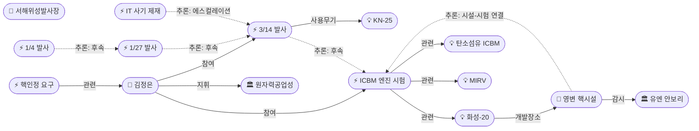
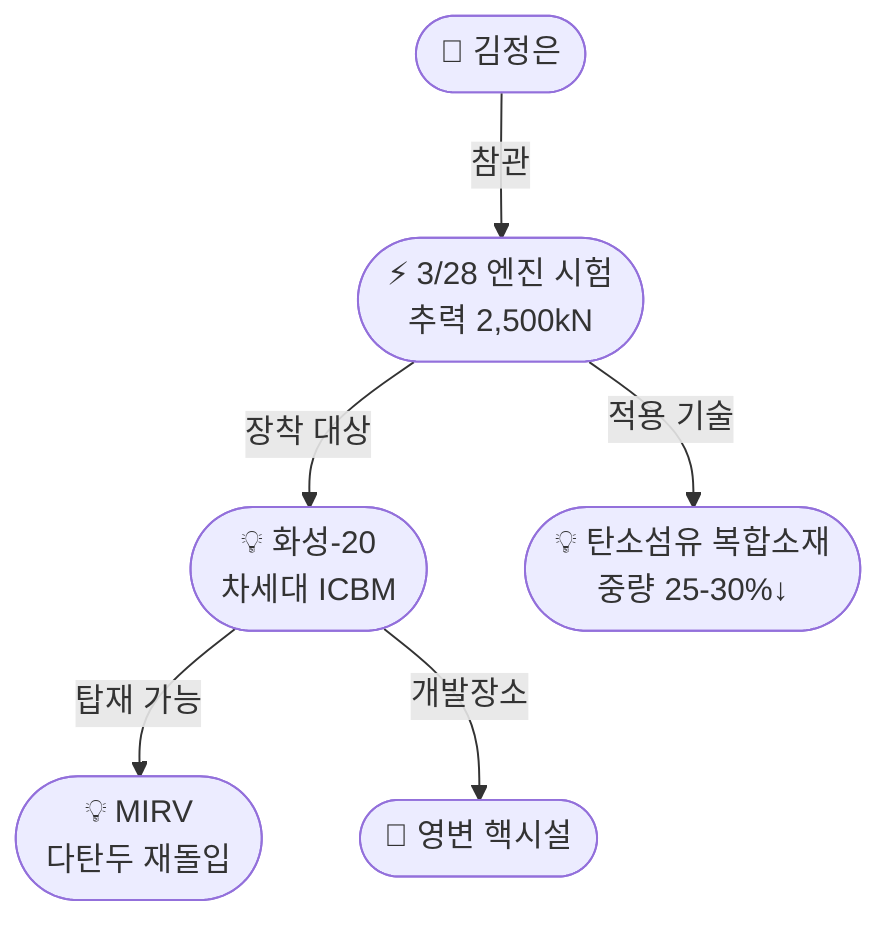

# 2026-04-07 북한 핵활동 모니터링 OSINT 일일 보고서

## 요약

북한이 3월 28일 탄소섬유 ICBM용 고체연료 엔진 지상시험을 실시하여 추력 2,500kN(전회 대비 26% 증가)을 달성했으며, 다탄두(MIRV) 탑재 가능성이 제기되고 있다. 영변 핵단지에서는 5MWe 원자로 가동, 경수로 시운전, 우라늄 농축시설 확장이 동시에 진행되고 있음이 위성영상으로 확인되었다. 외교적으로는 북한이 미국과의 대화 재개 조건으로 핵보유국 인정을 요구하며 비핵화 프레임 거부 의사를 명확히 했다. 서해위성발사장 인근 마을 철거가 확인되어 우주발사 인프라 확장도 진행 중이다.

## 주요 뉴스

### 1. ICBM 탄소섬유 엔진 지상시험 — 추력 26% 증가, MIRV 가능성
- **출처:** [yourNEWS](https://yournews.com/2026/04/06/6765109/north-korea-tests-engine-for-carbon-fiber-icbm-designed-for-multiple/), [US News](https://www.usnews.com/news/world/articles/2026-04-06/north-korea-working-on-carbon-fibre-icbm-for-multi-warhead-delivery-seoul-says), [VOA 코리아](https://www.voakorea.com/a/north-korea-tests-new-icbm-solid-fuel-engine-under-kim-jong-un-s-supervision-033026/8132438.html)
- **일시:** 2026-03-28 (보도: 2026-04-06)
- **내용:** 김정은 참관 하에 고체연료 엔진 지상시험을 실시. 최대 추력 2,500kN으로 2024년 9월 시험(1,971kN) 대비 약 26% 증가. 탄소섬유 복합소재를 사용하여 중량 25~30% 감소, 사거리 연장 및 다탄두 탑재가 가능해질 전망. 화성-20(Hwasong-20) ICBM에 장착 예상.
- **상태:** 신규
- **관련 엔티티:** 김정은, 화성-20, 탄소섬유 ICBM 기술, MIRV

### 2. 영변 핵단지 현대화 — 원자로 가동·농축시설 확장 동시 진행
- **출처:** [DailyNK](https://www.dailynk.com/20260407-3/), [Daily NK English](https://www.dailynk.com/english/north-korea-expands-nuclear-capabilities-yongbyon-facilities-operate-full-capacity/)
- **일시:** 2026-04-07
- **내용:** 위성영상 분석 결과, 영변 핵단지에서 ①5MWe 흑연감속로 7차 사이클 가동 지속(냉각수 배출 확인) ②실험용 경수로(ELWR) 시운전 단계 ③신규 우라늄 농축시설 건설 ④노후 대형 원자로 부지 철거가 동시에 진행 중. 핵물질 생산 체계를 유지하면서 장기 현대화를 병행하는 것으로 평가.
- **상태:** 신규
- **관련 엔티티:** 영변 핵시설, 원자력공업성

### 3. 서해위성발사장 인근 마을 철거 — 우주 인프라 확장 정황
- **출처:** [38 North](https://www.38north.org/2026/04/villages-bordering-sohae-satellite-launching-station-razed/)
- **일시:** 2026-04-01 (위성영상 기준)
- **내용:** 서해위성발사장(Sohae) 인접 장야동·자강동 2개 마을이 철거된 것이 위성영상으로 확인됨. 위성 및 반위성 무기가 새 5개년 계획에 포함되어 있어, 우주발사장 확장 목적으로 평가됨. 새 발사대, 시험시설, 조립건물, 산악 터널, 항구 등이 추가 건설 중.
- **상태:** 신규
- **관련 엔티티:** 서해위성발사장

### 4. 북한, 핵보유국 인정 요구하며 대미 대화 조건 제시
- **출처:** [Arms Control Association](https://www.armscontrol.org/act/2026-04/news/north-korea-seeks-nuclear-recognition-us-talks)
- **일시:** 2026-04
- **내용:** 북한이 미국과의 대화 재개 전제조건으로 핵보유국 인정을 요구. 기존 비핵화(denuclearization) 프레임을 거부하고 핵군축(arms control) 프레임으로의 전환을 시도. 이는 북한의 핵 전략이 "되돌릴 수 없는(irreversible)" 단계에 진입했다는 자신감의 표현으로 해석됨.
- **상태:** 신규
- **관련 엔티티:** 김정은, 핵인정 요구 대미 접촉

### 5. 2026년 미사일 도발 타임라인 — 에스컬레이션 패턴
- **출처:** [USNI News(1/4)](https://news.usni.org/2026/01/05/north-korea-conducts-first-missile-launch-of-2026-into-sea-of-japan), [The Diplomat(1/27)](https://thediplomat.com/2026/01/north-korea-fires-multiple-ballistic-missiles), [USNI News(3/14)](https://news.usni.org/2026/03/16/north-korea-fires-10-missiles-over-sea-of-japan-in-latest-multiple-rocket-launcher-system-test)
- **일시:** 2026-01-04 ~ 2026-03-14
- **내용:**
  - **1월 4일:** 극초음속 미사일 발사, 동해 1,000km 비행 (이재명-시진핑 정상회담 전날)
  - **1월 27일:** 단거리 탄도미사일 복수 발사, 350km 비행
  - **3월 14일:** KN-25 다연장로켓 10발 동시 발사 (한미 합동훈련 중, 포병 2개 중대·12개 발사대 동원)
- **상태:** 신규
- **관련 엔티티:** 김정은, KN-25

### 6. 대북 제재 강화 — 사이버·IT 사기 네트워크 타격
- **출처:** [US State Dept(3월)](https://www.state.gov/releases/office-of-the-spokesperson/2026/03/sanctions-to-disrupt-dprk-it-worker-schemes-defrauding-u-s-businesses/), [US State Dept(1월)](https://www.state.gov/releases/office-of-the-spokesperson/2026/01/multilateral-sanctions-monitoring-team-report-on-dprk-violations-and-evasions-of-un-sanctions-through-cyber-and-information-technology-worker-activities)
- **일시:** 2026-01 ~ 2026-03
- **내용:** MSMT 보고서에 따르면 북한 사이버 행위자들이 2024.1~2025.9 기간 40건 이상의 암호화폐 해킹으로 최소 28억 달러를 탈취. IT 인력은 중국·러시아 등 8개국에서 1,000~1,500명 활동. 미국은 2026년 3월 IT 사기 관련 2개 단체·6명 추가 제재, 1월 사이버범죄 수익 세탁 관련 8명·2개 단체 제재를 부과.
- **상태:** 신규
- **관련 엔티티:** 미국 재무부, 유엔 안보리

### 7. 38 North: 5년간 13개 핵·미사일 체계 개발 종합 평가
- **출처:** [38 North](https://www.38north.org/2026/01/assessing-north-koreas-five-year-effort-to-develop-13-new-nuclear-and-missile-systems/)
- **일시:** 2026-01
- **내용:** 38 North 종합 분석에 따르면 북한은 5년간 13개 신규 핵·미사일 체계를 개발했으며, 이 중 4개가 실전 배치 완료. 고체연료 ICBM 3종(화성-17/18/19)을 포함하여 전략 타격 능력이 질적으로 도약한 것으로 평가.
- **상태:** 신규
- **관련 엔티티:** 38 North, 화성-20, 화성-18

## 지식그래프

### 오늘의 주요 관계

- **김정은 → 원자력공업성 (지휘):** 핵 프로그램 총괄 지휘 체계
- **김정은 → ICBM 엔진 시험 (참여):** 3/28 시험 직접 참관, 전략무기 개발 우선순위 시사
- **화성-20 → 영변 핵시설 (개발장소):** ICBM과 핵물질 생산의 연결 고리
- **미사일 발사 3건 → UNSCR (위반):** 모든 발사가 UN 안보리 결의 위반
- **미사일 도발 → 제재 (에스컬레이션):** 3월 발사 → 3월 추가 제재 패턴
- **1/4 → 1/27 → 3/14 → 3/28 (이벤트 체인):** 도발 에스컬레이션 곡선

### 전체 지식그래프 시각화

### 주제별 세부 그래프: ICBM 개발 체계

## 온톨로지 변경

| 변경 유형 | 대상 | 근거 |
|----------|------|------|
| 스키마 초기화 | 전체 seed classes/relations | 첫 실행, config seed로 초기화 |
| 새 엔티티 20건 | 김정은, 영변, 화성-20 등 | 검색 결과에서 추출 |

## 추론 결과

| 추론 | 규칙 | 신뢰도 | 근거 |
|------|------|--------|------|
| 1/4→1/27→3/14 발사 에스컬레이션 체인 | event_chain | 0.85 | 시간순 미사일 발사 연쇄 |
| 3/14 발사 → 3/28 ICBM 엔진 시험 | event_chain | 0.80 | 무기 개발 프로그램 병행 |
| 3월 미사일 발사 → 3월 미국 추가 제재 | sanction_escalation | 0.75 | 도발-제재 에스컬레이션 패턴 |
| 영변 → 화성-20 → 엔진 시험 연결 | facility_weapon_link | 0.70 | 시설-무기-시험 간접 연결 |

## 분석 및 평가

**1. ICBM 능력 질적 도약 임박**

3월 28일 엔진 시험은 북한 ICBM 프로그램의 중요한 이정표다. 추력 26% 증가는 단순 성능 개선을 넘어 탄소섬유 복합소재와 MIRV 기술의 결합으로 미 본토 타격 능력의 마지막 퍼즐을 채워가고 있음을 시사한다. 화성-20의 비행시험이 2026년 내 이루어질 가능성이 높아졌다.

**2. 영변 핵시설 "전면 현대화" 전략**

영변에서의 동시 다발적 활동(원자로 가동 + 경수로 시운전 + 농축시설 확장 + 노후시설 철거)은 단순 유지보수가 아니라 핵물질 생산 체계의 장기 현대화를 의미한다. 이는 북한이 핵무기 프로그램을 일시적 도발 수단이 아닌 항구적 억지력으로 제도화하고 있음을 보여준다.

**3. 비핵화→핵군축 프레임 전환 시도**

핵보유국 인정 요구는 북한이 더 이상 비핵화 협상에 복귀할 의사가 없음을 공식화한 것으로 해석된다. 이는 ICBM 능력 확보, 핵물질 지속 생산, 13개 신규 무기체계 개발 등 물질적 능력 확보에 대한 자신감에 기반한 것으로 보인다.

**4. 도발-제재 에스컬레이션 사이클 지속**

2026년 미사일 발사 3건 → ICBM 엔진 시험 → 미국 추가 제재로 이어지는 에스컬레이션 사이클이 지속되고 있다. 그러나 사이버 활동을 통한 제재 회피($28억 탈취)가 제재 효과를 감쇠시키고 있어, 기존 제재 체제의 한계가 드러나고 있다.

## 추적 항목

| 항목 | 최초 보고 | 상태 | 비고 |
|------|----------|------|------|
| 화성-20 비행시험 시기 | 2026-04-07 | 감시 중 | 엔진 시험 완료, 비행시험 예상 |
| 영변 경수로 정식 가동 | 2026-04-07 | 감시 중 | 현재 시운전 단계 |
| 핵보유국 인정 협상 추이 | 2026-04-07 | 감시 중 | 미국 측 반응 미확인 |
| 서해위성발사장 확장 완료 시기 | 2026-04-07 | 감시 중 | 마을 철거 완료, 건설 진행 |
| 7차 핵실험 가능성 | 2026-04-07 | 감시 중 | 풍계리 핵실험장 준비 상태 유지 |

## 동향 요약

| 분류 | 상태 | 비고 |
|------|------|------|
| ICBM 개발 | 활발 | 탄소섬유 엔진 시험 성공, 화성-20 개발 가속 |
| 핵물질 생산 | 가동 중 | 영변 전면 가동, 농축시설 확장 |
| 미사일 도발 | 에스컬레이션 | 2026년 3차례 발사, 규모 확대 |
| 제재/사이버 | 강화/회피 병행 | 미국 추가 제재 vs 사이버 수익 $28억 |
| 외교 | 전략 전환 | 비핵화 거부, 핵보유국 인정 요구 |
| 우주/위성 | 인프라 확장 | 서해발사장 마을 철거, 5개년 계획 포함 |

## 출처 목록

1. [영변 핵단지 현대화…원자로 가동·농축시설 확장](https://www.dailynk.com/20260407-3/) - DailyNK, 2026-04-07
2. [North Korea Tests Engine for Carbon-Fiber ICBM Designed for Multiple Warheads](https://yournews.com/2026/04/06/6765109/north-korea-tests-engine-for-carbon-fiber-icbm-designed-for-multiple/) - yourNEWS, 2026-04-06
3. [North Korea Working on Carbon-Fibre ICBM for Multi-Warhead Delivery, Seoul Says](https://www.usnews.com/news/world/articles/2026-04-06/north-korea-working-on-carbon-fibre-icbm-for-multi-warhead-delivery-seoul-says) - US News, 2026-04-06
4. [북한, 김정은 참관하 ICBM 신형 엔진 시험](https://www.voakorea.com/a/north-korea-tests-new-icbm-solid-fuel-engine-under-kim-jong-un-s-supervision-033026/8132438.html) - VOA 코리아, 2026-03-30
5. [A New Rocket Motor Further Muddles North Korea's Solid-Propellant ICBM Outlook](https://www.38north.org/2026/04/a-new-rocket-motor-further-muddles-north-koreas-solid-propellant-icbm-outlook/) - 38 North, 2026-04
6. [North Korea's Three Solid-Fuel ICBMs: Power Behind Kim Jong-un's Most Coveted Arsenal](https://en.sedaily.com/politics/2026/04/01/north-koreas-three-solid-fuel-icbms-power-behind-kim-jong) - 서울경제, 2026-04-01
7. [Villages Bordering Sohae Satellite Launching Station Razed](https://www.38north.org/2026/04/villages-bordering-sohae-satellite-launching-station-razed/) - 38 North, 2026-04
8. [North Korea Seeks Nuclear Recognition for U.S. Talks](https://www.armscontrol.org/act/2026-04/news/north-korea-seeks-nuclear-recognition-us-talks) - Arms Control Association, 2026-04
9. [North Korea Fires 10 Missiles Over Sea of Japan in Latest MRLS Test](https://news.usni.org/2026/03/16/north-korea-fires-10-missiles-over-sea-of-japan-in-latest-multiple-rocket-launcher-system-test) - USNI News, 2026-03-16
10. [North Korea Launches Massive Ballistic Missile Barrage Amid South Korea-US Drills](https://thediplomat.com/2026/03/north-korea-launches-massive-ballistic-missile-barrage-amid-south-korea-us-drills/) - The Diplomat, 2026-03
11. [North Korea Conducts First Missile Launch of 2026 into Sea of Japan](https://news.usni.org/2026/01/05/north-korea-conducts-first-missile-launch-of-2026-into-sea-of-japan) - USNI News, 2026-01-05
12. [North Korea Fires Multiple Ballistic Missiles](https://thediplomat.com/2026/01/north-korea-fires-multiple-ballistic-missiles) - The Diplomat, 2026-01
13. [Sanctions to Disrupt DPRK IT Worker Schemes Defrauding U.S. Businesses](https://www.state.gov/releases/office-of-the-spokesperson/2026/03/sanctions-to-disrupt-dprk-it-worker-schemes-defrauding-u-s-businesses/) - US State Dept, 2026-03
14. [Multilateral Sanctions Monitoring Team Report on DPRK Violations](https://www.state.gov/releases/office-of-the-spokesperson/2026/01/multilateral-sanctions-monitoring-team-report-on-dprk-violations-and-evasions-of-un-sanctions-through-cyber-and-information-technology-worker-activities) - US State Dept, 2026-01
15. [Treasury Sanctions DPRK Bankers and Institutions](https://home.treasury.gov/news/press-releases/sb0302) - US Treasury, 2026
16. [Assessing North Korea's Five-Year Effort to Develop 13 New Nuclear and Missile Systems](https://www.38north.org/2026/01/assessing-north-koreas-five-year-effort-to-develop-13-new-nuclear-and-missile-systems/) - 38 North, 2026-01
17. [When North Korea can strike America: a dangerous policy gap](https://asiatimes.com/2026/04/when-north-korea-can-strike-america-a-dangerous-policy-gap/) - Asia Times, 2026-04
18. [North Korea expands nuclear capabilities as Yongbyon facilities operate at full capacity](https://www.dailynk.com/english/north-korea-expands-nuclear-capabilities-yongbyon-facilities-operate-full-capacity/) - Daily NK English, 2026
19. [Satellite images suggest N. Korea expanding military drone production](https://www.koreaherald.com/article/10703740) - Korea Herald, 2026
20. [2025년 북한 경제 평가와 2026년 전망](https://sejong.org/web/boad/1/egoread.php?itm=&txt=&pg=2&bd=1&seq=12565) - 세종연구소, 2026
